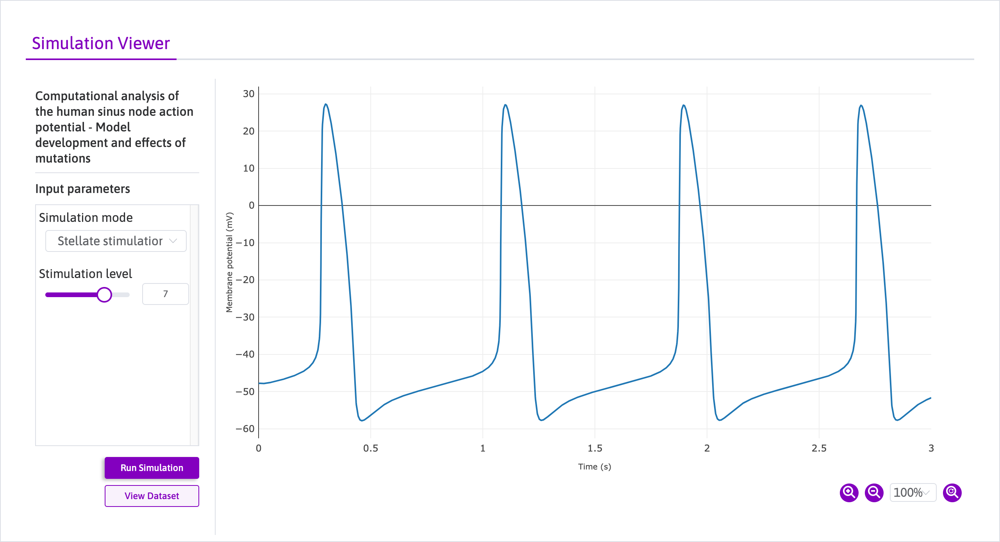

# SimulationVuer

SimulationVuer is a [Vue](https://vuejs.org/) component used in the [SPARC portal](https://sparc.science/) to run some simulation-based [datasets](https://sparc.science/data?type=dataset).
Some of those datasets (e.g., [135](https://sparc.science/datasets/135?type=simulation) and [157](https://sparc.science/datasets/157?type=simulation)) reference a [CellML](https://cellml.org/)-based model of some biological process and include a [JSON](https://json.org/) file.

The JSON file is used by SimulationVuer to create a user interface (Fig. 1).
The interface can then be used by someone to configure the simulation and then run it.
Using the [SPARC API](https://github.com/nih-sparc/sparc-api), SimulationVuer asks [oSPARC](https://osparc.io/) to run the model (using its [OpenCOR](https://opencor.ws/)-based service) and to retrieve the simulation results, which can then be visualised and interacted with using the interface.


*Figure 1: user interface for dataset [135](https://sparc.science/datasets/simulationviewer?id=135).*

## How to use

To install the package to your Vue application:

```bash
npm install @abi-software/simulationvuer
```

To include the package in your script:

```javascript
import { SimulationVuer } from '@abi-software/simulationvuer';
```

To register in a Vue component:

```javascript
export default {
  ...
  components: {
    ...,
    SimulationVuer,
    ...
  }
  ...
}
```

The above registers the SimulationVuer component into the global scope.
You can now use the SimulationVuer in your Vue template as follows:

```html
<SimulationVuer :apiLocation="apiLocation" :id=123 />
```

where `apiLocation` is the URL to the API location and `id` the id of the simulation-based dataset.

## Project setup

### Clone the respository

```bash
git clone https://github.com/ABI-Software/simulationvuer.git
```

### Vue component

#### Setup

```bash
npm install
```

#### Run the sample application

```bash
npm run serve
```

#### Compile and minify for production

```bash
npm run build-bundle
```

## Vue 2 vs. Vue 3

SimulationVuer is now being developed as a Vue 3 component only.
The [Vue 2 version of SimulationVuer](https://github.com/ABI-Software/simulationvuer/tree/vue2) is not maintained anymore.

## Documentation

The documentation is written using [VitePress](https://vitepress.dev/) and [vuese](https://github.com/vuese/vuese#readme), and it can be found in the `docs` folder.

#### To run in local development mode

```bash
npm run docs:watch
```

This will start the documentation server with [VitePress](https://vitepress.dev/) on port `5173`: http://localhost:5173/simulationvuer/.
