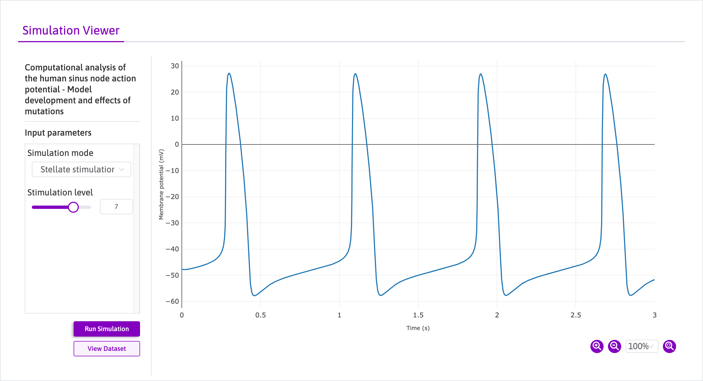

# SimulationVuer

SimulationVuer is a [Vue](https://vuejs.org/) 3 component used in the [SPARC portal](https://sparc.science/) to run some simulation-based [datasets](https://sparc.science/data?type=dataset) that include a [JSON](https://json.org/) file. That JSON file is used by SimulationVuer to create a user interface (Fig. 1) which can then be used by someone to configure a simulation before running it.

The simulation is run either on [oSPARC](https://osparc.io/) or in a user's browser, depending on how the simulation-based dataset is referenced (see the `id` property below). In the oSPARC case, SimulationVuer relies on the [SPARC API](https://github.com/nih-sparc/sparc-api) to ask oSPARC to run the model and to retrieve the simulation results, which can then be visualised and interacted with using the interface.


_Figure 1: user interface for dataset [135](https://sparc.science/datasets/simulationviewer?id=135)._

## How to use

To install the package in your Vue application:

```bash
npm install @abi-software/simulationvuer
```

To include the package in your script:

```javascript
import { SimulationVuer } from "@abi-software/simulationvuer";
```

To register the package as a Vue component:

```javascript
export default {
  ...
  components: {
    ...,
    SimulationVuer,
    ...
  }
  ...
}
```

The above registers the SimulationVuer component into the global scope. You can now use SimulationVuer in your Vue template as follows:

```html
<SimulationVuer :apiLocation="apiLocation" :id="123" />
```

where:

- `apiLocation` is the URL of a running copy of the [SPARC API](https://github.com/nih-sparc/sparc-api); and
- `id` is:
  - the id of a SPARC simulation-based dataset (as a `Number`, e.g., `135`);
  - the [PMR](https://models.physiomeproject.org/) path to an [OMEX](https://combinearchive.org/) file (as a `String`, e.g., `workspace/b7c/rawfile/e0ae8d2d56aaaa091e23e1ee7e84cacbda1dfb6b/135.omex`);
  - the direct URL to an OMEX file (as a `String`, e.g., `https://raw.githubusercontent.com/opencor/webapp/refs/heads/main/tests/models/ui/135.omex`); or
  - a raw OMEX file (as a `Uint8Array`).

Note that a simulation will be run on oSPARC if the `id` references a SPARC simulation-based dataset, in a user's browser otherwise.

## Deployment

SimulationVuer uses [@opencor/opencor](https://www.npmjs.com/package/@opencor/opencor), which relies on [libOpenCOR](https://github.com/opencor/libopencor)'s threaded WebAssembly (WASM) to run simulations in the browser. Threaded WASM requires [`SharedArrayBuffer`](https://developer.mozilla.org/en-US/docs/Web/JavaScript/Reference/Global_Objects/SharedArrayBuffer), which in turn requires the page to be served with **cross-origin isolation** headers.

When deploying an application that uses SimulationVuer, your Web server **must** must send the following headers with the HTML document:

```http
Cross-Origin-Opener-Policy: same-origin
Cross-Origin-Embedder-Policy: require-corp
```

Without these headers, @opencor/opencor will fail to initialise libOpenCOR and will not function.

The exact steps to set these headers depend on your Web server. Here are the steps for Apache:

1. **Enable `mod_headers`**. Ensure the `headers` module is enabled (e.g., `a2enmod headers` or add it to your modules list).
2. **Set headers on the HTML path**. In your virtual host config, add:

   ```apache
   <Location "/app">
       Header set Cross-Origin-Opener-Policy "same-origin"
       Header set Cross-Origin-Embedder-Policy "require-corp"
   </Location>
   ```

   Adjust the `Location` path to match the URL prefix where the Web app is served (here, we use `/app` assuming the Web app is served from `https://your-domain.com/app`).

3. **Reload Apache**. Apply the changes with `sudo apachectl reload` or the equivalent for your distribution.
4. **Verify**. Check the response headers on your deployed HTML page using:

   ```bash
   curl -I https://your-domain.com/app/
   ```

   You should see:

   ```http
   cross-origin-opener-policy: same-origin
   cross-origin-embedder-policy: require-corp
   ```

## Project setup

### Clone the respository

```bash
git clone https://github.com/ABI-Software/simulationvuer.git
```

### Vue component

#### Setup

```bash
npm install
```

#### Run the sample application

```bash
npm run serve
```

#### Compile and minify for production

```bash
npm run build-bundle
```

## Vue 2 vs. Vue 3

SimulationVuer is now being developed as a Vue 3 component only. The [Vue 2 version of SimulationVuer](https://github.com/ABI-Software/simulationvuer/tree/vue2) is not maintained anymore.

## Documentation

The documentation is written using [VitePress](https://vitepress.dev/) and [vuese](https://github.com/vuese/vuese#readme), and it can be found in the `docs` folder.

#### To run in local development mode

```bash
npm run docs:watch
```

This will start the documentation server with [VitePress](https://vitepress.dev/) on port `5173`: http://localhost:5173/simulationvuer/.
